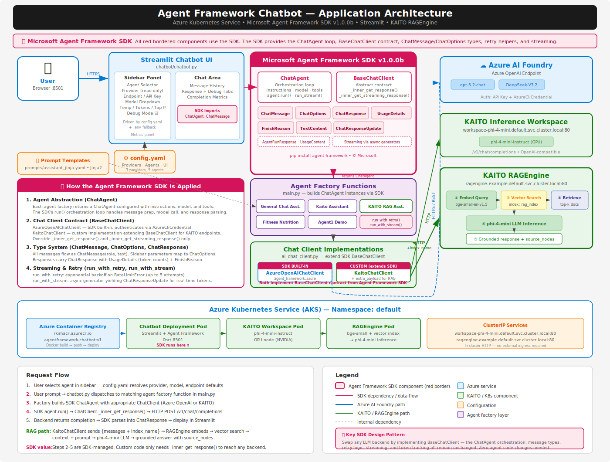

# Building A Chatbot with Microsoft Agent Framework on Azure Kubernetes

The **Microsoft Agent Framework SDK** is a Python library for building AI agent applications.

### Why I Used Microsoft Agent Framework SDK?

After building individual Streamlit chatbots directed to different AI Providers and Models (Open AI, AI Foundry, AKS KAITO hosted, KAITO RAG Engine, etc), I decided to build an extensible Streamlit chat bot that I can orchestrate, configure and select various AI providers for my agents. **This gives me my own playground and testing platform for testing my agents and AI providers/models**. 


<Screenshot>

### Microsoft Agent Framework Implementation Approach

A multi-agent AI chatbot built with Microsoft's [Agent Framework SDK](https://pypi.org/project/agent-framework/) (v1.0.0b), deployed on Azure Kubernetes Service (AKS) with a Streamlit web UI. The project demonstrates how to use the SDK's `ChatAgent` orchestration loop and `BaseChatClient` contract to support multiple LLM backends — Azure AI Foundry, KAITO GPU inference, and KAITO RAGEngine — through a single, config-driven architecture.

Microsoft's Agent Framework SDK, helps orchestrate LLM calling and various tools. The SDK helps implement a factory design pattern with `ChatAgent` which owns the orchestration loop, `BaseChatClient` defines the only contract you need to implement per backend, and the type system (`ChatMessage`, `ChatOptions`, `ChatResponse`) ensures every agent speaks the same language regardless of which LLM it targets.



## What This Project Demonstrates

- **Agent Framework SDK fundamentals** — `ChatAgent`, `BaseChatClient`, `ChatMessage`, `ChatOptions`, `ChatResponse`, `UsageDetails`, streaming, and retry patterns.
- **Custom chat client implementation** — `KaitoChatClient` extends the SDK's `BaseChatClient` to call any OpenAI-compatible endpoint, including KAITO and RAGEngine, with a single `_inner_get_response()` override.
- **Config-driven agent selection** — A YAML configuration file (`chatbot/config.yaml`) defines providers, agents, models, and UI settings. The Streamlit sidebar renders dynamically from this config with environment variable fallbacks.
- **Multi-backend routing** — Five agents connect to three distinct backends without any changes to the SDK orchestration layer.
- **RAG without application-side retrieval code** — The KAITO RAGEngine agent sends an `index_name` field alongside the chat payload; all embedding, vector search, and context injection happens server-side on the GPU pod.
- **Production Kubernetes deployment** — Kustomize manifests, Ingress-NGINX, HPA autoscaling, ConfigMap/Secret injection, ACR image management, and health probes.

## Tech Stack

| Layer | Technology |
|---|---|
| Language | Python 3.13 |
| Package Manager | [uv](https://docs.astral.sh/uv/) (Astral) |
| AI Orchestration | [Microsoft Agent Framework SDK](https://pypi.org/project/agent-framework/) v1.0.0b |
| Web UI | [Streamlit](https://streamlit.io/) |
| LLM Providers | Azure AI Foundry (GPT-5.2, DeepSeek-V3.2), KAITO 0.8.x (phi-4-mini-instruct) |
| RAG | KAITO 0.8.x RAGEngine (bge-small-en-v1.5 embeddings + phi-4-mini inference) |
| Prompt Templates | Jinja2 YAML templates |
| Container | Docker (python:3.13-slim) |
| Application Hosting | Azure Kubernetes Service (AKS) |
| K8s Deployment | Kustomize (`kubectl apply -k`) |
| Container Registry | Azure Container Registry (ACR) |
| Ingress | NGINX Ingress Controller |
| Python Linting | Ruff, mypy |


## Agents

| Agent | Provider | Model | Description |
|---|---|---|---|
| **General Chat Assistant** | Azure AI Foundry | gpt-5.2-chat | General-purpose assistant via Azure OpenAI |
| **Kaito Assistant** | KAITO | phi-4-mini-instruct | Direct LLM inference on in-cluster GPU |
| **KAITO RAG Assistant** | KAITO RAGEngine | phi-4-mini-instruct | RAG-augmented answers (embed → vector search → LLM) |
| **Fitness Nutrition** | Azure AI Foundry | gpt-5.2-chat | Image-based macro nutrient estimation (WORK IN PROGRESS) |
| **Agent1 Demo** | Azure AI Foundry | gpt-5.2-chat | Demo Playground to experiment with Multi-step workflow with structured output + SQLite persistence |


**Key design pattern:** The `ChatAgent` never knows which backend it's calling. It only calls `BaseChatClient._inner_get_response(messages, chat_options)`. To add a new LLM backend, implement a new `BaseChatClient` subclass — zero changes to `ChatAgent`, the Streamlit Chatbot UI, or the config dispatch.

---

## Setup and Deployment

### Prerequisites

- Python 3.13+
- [uv](https://docs.astral.sh/uv/getting-started/installation/) package manager
- Docker (or Podman)
- Azure CLI (`az`) with an active subscription
- `kubectl` configured for your AKS cluster
- An Azure AI Foundry / Azure OpenAI resource (for Foundry-based agents)
- A KAITO workspace deployed in your AKS cluster (for KAITO-based agents).

### 1. Clone and Install Dependencies

```bash
git clone https://github.com/RoyKimYYZ/azureai-chatapp.git
cd azureai-chatapp/agentframework

# Install uv if not already installed
curl -LsSf https://astral.sh/uv/install.sh | sh

# Create venv and install dependencies
uv sync
```

### 2. Configure Environment Variables

```bash
cp .env-sample .env
# Edit .env with your values:
#   AZURE_OPENAI_ENDPOINT, AZURE_OPENAI_API_KEY, AZURE_OPENAI_CHAT_DEPLOYMENT_NAME
#   KAITO_INFERENCE_ENDPOINT (e.g., http://workspace-phi-4-mini.default.svc.cluster.local:80)
#   KAITO_RAGENGINE_ENDPOINT (e.g., http://ragengine-example.default.svc.cluster.local:80)
```

### 3. Run Locally

```bash
# Streamlit chatbot UI
uv run streamlit run chatbot/chatbot.py

# CLI agents
uv run python cli.py agent1
uv run python cli.py fitness food-images/sample.jpg
```

### 4. Build and Push Docker Image

```bash
# Build, push to ACR, and restart the AKS deployment
./run_docker_acr.sh
```

This script:
1. Authenticates to Azure Container Registry (`rkimacr.azurecr.io`)
2. Builds the Docker image using `chatbot-Dockerfile`
3. Pushes `agentframework-chatbot:v1` to ACR
4. Runs `kubectl rollout restart` to deploy the new image

### 5. Deploy to AKS

```bash
cd aks

# Copy and fill in your secrets
cp secret.yaml-sample secret.yaml
# Edit secret.yaml with base64-encoded API keys

# Deploy all resources via Kustomize
./runbook_deploy.sh
```

The deployment script:
1. Attaches ACR to the AKS cluster (cross-subscription RBAC)
2. Detects the Ingress-NGINX controller's external LoadBalancer IP
3. Patches the Ingress host rule with the detected IP
4. Applies all manifests via `kubectl apply -k`

### 6. Access the Application

```
http://<INGRESS_EXTERNAL_IP>/agentframework-chatbot
```

### Kubernetes Resources Created

| Resource | Name | Details |
|---|---|---|
| Deployment | `agentframework-chatbot` | 1–3 replicas, CPU 100m–1, Mem 512Mi–1Gi |
| Service | `agentframework-chatbot` | ClusterIP, port 80 → targetPort 8501 |
| Ingress | `agentframework-chatbot` | NGINX class, path `/agentframework-chatbot` |
| HPA | `agentframework-chatbot` | Scale at 70% CPU average utilization |
| ConfigMap | `agentframework-chatbot-config` | Non-sensitive environment variables |
| Secret | `agentframework-chatbot-secrets` | API keys (git-ignored) |

---


### The BaseChatClient Pattern: One Abstraction, Many Backends

The most impactful architectural implementation in this project is the `BaseChatClient` contract. By implementing a single method — `_inner_get_response()` — you can connect the same `ChatAgent` orchestration to Azure OpenAI, a self-hosted KAITO model on a GPU node pool, or a KAITO RAGEngine that handles vector searches. This is the Strategy pattern that allows for swapping models, comparing latency across AI providers, or adding a new backend requires zero to minimal changes to agent logic and Chatbot UI code.


### KAITO and RAGEngine: GPU Inference as a Kubernetes-Native Concern

KAITO (Kubernetes AI Toolchain Operator) treats model deployment the same way Kubernetes treats any other workload: declare what you want in a manifest, and the operator provisions GPU nodes, pulls model weights, and exposes an OpenAI-compatible endpoint as a ClusterIP service. This means your application code doesn't need to know whether it's calling a cloud API or a model running on the same cluster — the abstraction is the Kubernetes service DNS name.

RAGEngine takes this further by running the full RAG pipeline (embedding, vector search, context retrieval, LLM inference) server-side behind a single API call. Your application just sends `{"messages": [...], "index_name": "rag_index"}` — no LangChain, no client-side vector store, no embedding pipeline code. This is a meaningful simplification for production RAG applications.

If you're deploying models on Kubernetes, explore KAITO before building custom Helm charts for model serving. The operator handles GPU node provisioning, model weight caching, and health checking — concerns that are surprisingly complex to get right manually.

### Config-Driven Architecture for Agent Applications

This chatbot UI is to support multiple AI providers and their models with different parameter ranges, prompt templates, and deployment-specific endpoints. This project uses a YAML configuration file (`config.yaml`) with environment variable fallbacks to manage this complexity. The Streamlit sidebar renders dynamically from the config, and the agent dispatch reads from the same source. This means you can add a new agent and their respective AI Provider and default mode by adding a YAML block.

---

## Architecture Diagrams

- [Application + SDK Architecture](architecture-v2-sdk.svg) — highlights Agent Framework SDK components
- [Kubernetes Deployment Architecture](k8s-deployment-architecture.svg) — overlays K8s resources onto the application view
- [Sequence Diagram](sequence-diagram.svg) — end-to-end request flow across all three execution paths


This project is for educational and demonstration purposes.

---

## References and Documentation

### Microsoft Agent Framework SDK

- [agent-framework on PyPI](https://pypi.org/project/agent-framework/) — package page with version history and install instructions
- [microsoft/agents](https://github.com/microsoft/agents) — official GitHub repo (Python SDK lives under `python/`)
- [Microsoft Agents SDK documentation](https://learn.microsoft.com/en-us/microsoft-cloud/dev/ai/agents-sdk) — official Microsoft Learn docs for the Agents SDK

### KAITO (Kubernetes AI Toolchain Operator)

- [kaito-project/kaito](https://github.com/kaito-project/kaito) — official GitHub repo for the KAITO operator
- [KAITO RAGEngine documentation](https://github.com/kaito-project/kaito/blob/main/docs/ragengine/ragengine.md) — RAGEngine architecture, CRD reference, and API
- [KAITO on Microsoft Learn](https://learn.microsoft.com/en-us/azure/aks/ai-toolchain-operator) — AKS AI Toolchain Operator (KAITO) overview and quickstart
- [Deploy AI models with KAITO](https://learn.microsoft.com/en-us/azure/aks/deploy-kaito) — step-by-step deployment guide

### Azure Kubernetes Service (AKS)

- [AKS documentation](https://learn.microsoft.com/en-us/azure/aks/) — official Azure Kubernetes Service docs
- [Kustomize documentation](https://kustomize.io/) — declarative Kubernetes configuration management
- [NGINX Ingress Controller](https://kubernetes.github.io/ingress-nginx/) — ingress controller used in this project

### Azure AI Foundry / Azure OpenAI

- [Azure AI Foundry documentation](https://learn.microsoft.com/en-us/azure/ai-foundry/) — model catalog, deployments, and SDKs
- [Azure OpenAI Service documentation](https://learn.microsoft.com/en-us/azure/ai-services/openai/) — GPT model deployment and API reference
- [openai/openai-python](https://github.com/openai/openai-python) — Python client used under the hood by Azure OpenAI

### Streamlit

- [Streamlit documentation](https://docs.streamlit.io/) — official docs for the web UI framework
- [streamlit/streamlit](https://github.com/streamlit/streamlit) — official GitHub repo
- [Streamlit Chat elements](https://docs.streamlit.io/develop/api-reference/chat) — `st.chat_message`, `st.chat_input`, and chat UI patterns
- [Deploy Streamlit on Kubernetes](https://docs.streamlit.io/deploy/tutorials/kubernetes) — official Kubernetes deployment guide

### Python Tooling

- [astral-sh/uv](https://github.com/astral-sh/uv) — fast Python package manager and project tool
- [astral-sh/ruff](https://github.com/astral-sh/ruff) — linter and formatter used in this project
- [Jinja2 documentation](https://jinja.palletsprojects.com/) — template engine used for prompt templates